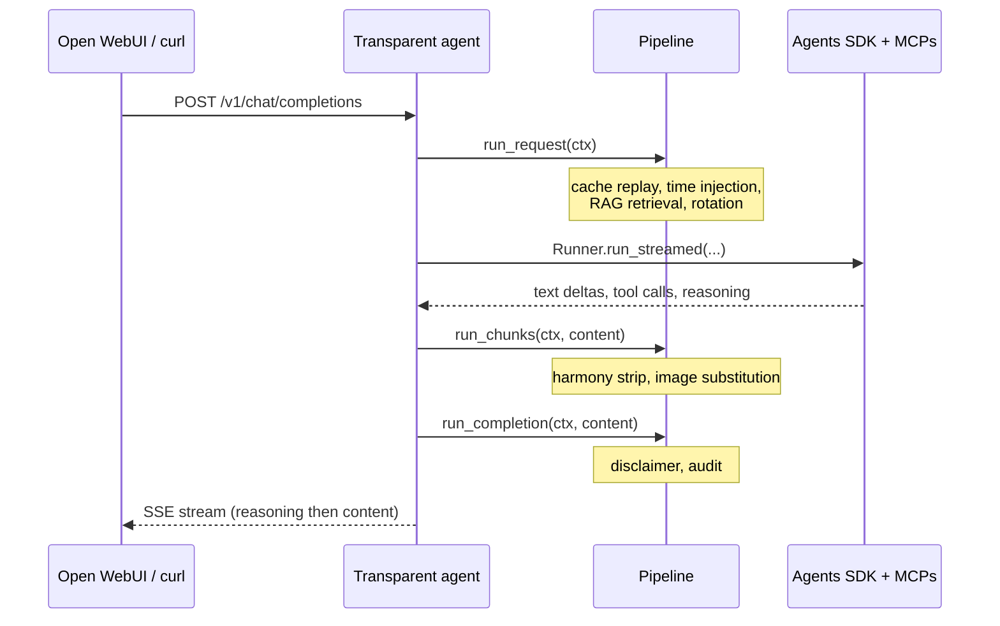

Hello everyone! Has been a long time since I last posted here, but hey! as they say better late than never!

As many of you can imagine, based on my content, I've always been a homelab enthusiast, and the last addition to my homelab was a DGX Spark from Nvidia.

I remember since the first time I saw a computer the first thing that came to my mind was:

> How can I make something like this? How does this computer-thing works? How can I make it do what I want?

And this is what pushed me to learn about things, how to build them, and obviously it could not be different when we talk about AI.

I see all these big companies doing fun things and I was thinking how could I do something similar? How can I make the user experience better? More powerful without requiring the user to install a lot of things on their machines.

From my previous experience I was thinking about transparent proxies and how they work and then I had the idea:

> What if we could make a transparent proxy that has an agent on it?

And here we are! Let me share with you how the concept works.

<!--more-->

The reason for this whole pattern is simple: every chat client I already use speaks the OpenAI Chat Completions API, Open WebUI, Cursor, the OpenAI SDK, n8n's HTTP node, all of them. None of them speak any "agent protocol" because there isn't one yet. So whatever I build has to look like a model from the wire, and still behave like an agent inside.

I'm calling this a *transparent agent*. The transparent proxy in HTTP is the same idea: a proxy that sits between client and origin and intercepts traffic without the client having to know it's there. Squid, HAProxy, Envoy, NGINX all support it. The client doesn't configure anything special, doesn't speak a different protocol, just makes the same request it always made, and a proxy in the middle does whatever it does while the client sees a normal response back.

Same idea, one layer up:

> A transparent proxy sits between client and origin without requiring client configuration. The client thinks it's talking directly to the origin; the proxy is invisible to it.

> A transparent agent sits between client and model without requiring client configuration. The client thinks it's talking directly to a chat completions model; the agent is invisible to it.

The agent reaches out to MCP servers, retrieves from a vector store, summarizes old turns, dispatches tools, and assembles a reply. The client posts to `/v1/chat/completions`, gets a streaming response, and never finds out that the response came from three MCP calls, a vector retrieval, and four turns of tool dispatching. All of the complexity stays on the server.

I tried a few other names before this one stuck. *Smart model* and *wrapped model* got the wire surface right but the substance wrong, this thing is an agent, not a model. *Agent gateway* and *agentic gateway* are basically taken by agentgateway.dev (a real project, but it does inter-agent A2A/MCP routing, not what I'm building). *Wire agent* and *hosted agent* were close but they don't say what's invisible, which is the whole point. *Transparent agent* hangs off a real networking term, and the rest of the post leans on it.

## Why a callback proxy is the wrong place

The first version of this in my homelab ran on top of [LiteLLM](https://docs.litellm.ai/) with a callback hook. LiteLLM is a great router, and lets you hook into each request and response with a Python plugin. So the hook intercepted the prompt, did a vector search, injected a `<retrieved_context>` system message, did a small amount of cleanup on the way out, and called it done.

This works for one round. It breaks the moment the model wants to call a tool, get a result, and call another tool. The hook fires once per HTTP request. The agent loop the OpenAI SDK runs is multiple HTTP requests with tool messages in between. You can fake one round by parsing the response, dispatching the tool yourself, and stitching a follow-up call. At that point you have reimplemented the agent loop inside a callback that wasn't designed to host one. The state ends up split across the proxy and the client and nobody owns the conversation. In practice that meant Open WebUI re-sending the entire chat history on every turn, including the base64 of any chart we had emitted. We paid for the same image five turns in a row.

The lesson everyone hits eventually: a callback layer is the wrong place to host an agent loop or any meaningful conversational state. You need something that *owns* the conversation. A callback hook can't, by design. A transparent agent does, also by design.

## What does fit

A small HTTP service that exposes `/v1/chat/completions` and runs the [OpenAI Agents SDK](https://openai.github.io/openai-agents-python/) inside. The agent reaches out to MCP servers, retrieves from pgvector, and streams back. From the client's side it's still a chat completions endpoint, it points at a model name I picked. Internally it's a proper agent loop with `max_turns=10`.

Three pipelines ended up sitting around the agent:

`on_request` mutates the message list before the agent runs. The conversation cache replays here, retrieved context gets injected, a temporal "today is" line gets added, and rotation drops the oldest pairs if the conversation got too long. `on_chunk` operates on the assembled assistant text after the agent finishes, before the client sees it. Strip out tokenizer artifacts, swap placeholder strings for image data URLs, redact things you should never have allowed the model to emit in the first place. `on_completion` is the last gate. Append a disclaimer in the user's language, write an audit row, send.

Each processor is a Python class, declared by name on the YAML, loaded on the right pipeline. Adding a new one is a one-line registry entry plus a file. Removing one is a one-line config edit. The orchestration code stays small, around 180 lines in the version I have now, and the agent assembly is 90 lines, mostly MCP wiring.

The rule that makes this work: every piece of behavior the client never sees lives in a processor, and every processor either runs *before the agent* (to shape what the agent sees) or *after the agent* (to shape what the client sees). The agent stays clean. It runs the loop and that's it.

## What's next

This post is the opener. The next one is about the conversation cache and KV-prefix stability, since Open WebUI re-sends the full chat history on every turn and the upstream prompt cache invalidates the moment we inject anything the client never saw. The fix is keeping our own canonical view of the conversation, keyed by `chat_id`, and replaying that instead of what the client sent.

After that, background context compaction. When the cached prefix grows past a threshold, an out-of-band task summarizes the oldest turns into one system message and atomically swaps it in, race-safe via Redis WATCH/MULTI, and the current request never blocks waiting for it.

Then the smaller context-reduction tricks: image substitution at egress so the model never sees base64, placeholder-form caching so we don't pay for the same chart twice, pair-aligned rotation as a floor when even compaction can't keep up.

Then the reasoning channel, streaming reasoning tokens before content so the o1-style "thinking" panel works in clients that already render `reasoning_content`, without any client-side code.

And finally the metrics worth keeping. Token-inflation per processor is the one chart that pays for itself, the rest is usual SRE hygiene.

That is all for this post, it is quite long already! I will be documenting my struggles trying to justify why I spent so much money on a DGX Spark, if this is something that interests you, make yourself at home, you are a welcome guest!

Until next post! 
