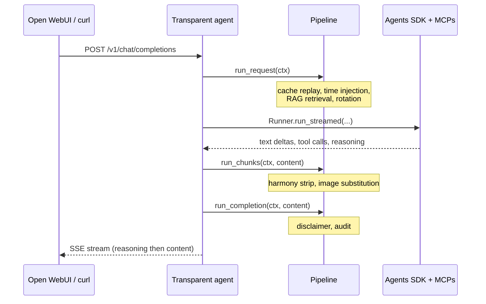

Hello everyone! Has been a long time since I last posted here, but hey! as they say better late than never!

As many of you can imagine, based on my content, I've always been a homelab enthusiast, and the last addition to my homelab was a DGX Spark from Nvidia.

I remember since the first time I saw a computer the first thing that came to my mind was:

> How can I make something like this? How does this computer-thing works? How can I make it do what I want?

And this is what pushed me to learn about things, how to build them, and obviously it could not be different when we talk about AI.

I see all these big companies doing fun things and I was thinking how could I do something similar? How can I make the user experience better? More powerful without requiring the user to install a lot of things on their machines.

From my previous experience I was thinking about transparent proxies and how they work and then I had the idea:

> What if we could make a transparent proxy that has an agent on it?

And here we are! Let me share with you how the concept works.

<!--more-->

The constraint that drove the whole pattern is mundane: every chat client I already use speaks the OpenAI Chat Completions API. Open WebUI does. Cursor does. The OpenAI SDK does. n8n's HTTP node does. None of them speak "agent protocol" because there isn't one yet. So whatever I build has to look like a model from the wire, while behaving like an agent inside.

I'm calling this a *transparent agent*. The lineage is the *transparent proxy* in networking: an HTTP proxy sitting between client and origin that intercepts traffic without requiring the client to know it's there. Squid, HAProxy, Envoy, NGINX all support it. The client doesn't configure anything, doesn't get a special endpoint, doesn't speak a different protocol. It just makes the same request it always made, and a proxy in the middle does whatever it does while the client sees a normal response.

Same shape applies one layer up:

> A transparent proxy sits between client and origin without requiring client configuration. The client thinks it's talking directly to the origin; the proxy is invisible to it.

> A transparent agent sits between client and model without requiring client configuration. The client thinks it's talking directly to a chat completions model; the agent is invisible to it.

The agent reaches out to MCP servers, retrieves from a vector store, summarises old turns, dispatches tools, and assembles a reply. The client posts to `/v1/chat/completions`, gets a streaming response, and never finds out that the response came from three MCP calls, a vector retrieval, and four turns of tool dispatching. All of the complexity stays on the server.

I tried a few other names before this one stuck. *Smart model* and *wrapped model* were both accurate to the wire surface but wrong about the substance: this thing is an agent, not a model. *Agent gateway* and *agentic gateway* drifted toward agentgateway.dev (which is a real project doing inter-agent A2A/MCP routing, not the same pattern). *Wire agent* and *hosted agent* were close but didn't carry the *invisible from the client's view* idea that makes transparent proxies the load-bearing analogy. *Transparent agent* hangs off a precise networking term and the rest of the post can lean on it.

## Why a callback proxy is the wrong place

The first version of this in the homelab ran on top of [LiteLLM](https://docs.litellm.ai/) with a callback hook. LiteLLM is excellent as a router, and exposes a Python plugin model where each request and response can be intercepted. So the hook intercepted the prompt, did a vector search, injected a `<retrieved_context>` system message, did a small amount of cleanup on the way out, and called it done.

This works for one round. It breaks the moment the model wants to call a tool, get a result, and call another tool. The hook fires once per HTTP request. The agent loop the OpenAI SDK runs is multiple HTTP requests with tool messages in between. You can fake one round by parsing the response, dispatching the tool yourself, and stitching a follow-up call. At that point you have reimplemented the agent loop inside a callback that wasn't designed to host one. The state ends up split across the proxy and the client and nobody owns the conversation. In practice that meant Open WebUI re-sending the entire chat history on every turn, including the base64 of any chart we had emitted. We paid for the same image five turns in a row.

The lesson is the one everyone arrives at sooner or later: a callback layer is the wrong place to host an agent loop or any meaningful conversational state. You need something that *owns* the conversation. A callback hook can't, by design. A transparent agent does, also by design.

## What does fit

A small HTTP service that exposes `/v1/chat/completions` and runs the [OpenAI Agents SDK](https://openai.github.io/openai-agents-python/) inside. The agent reaches out to MCP servers, retrieves from pgvector, and streams back. From the client's side it's still a chat completions endpoint pointing at a model name you picked. Internally it's a proper agent loop with `max_turns=10`.

The shape that emerged has three pipelines around the agent:

`on_request` mutates the message list before the agent runs. That is where conversation cache replay happens, where retrieved context gets injected, where a temporal "today is" line is added, where rotation drops the oldest pairs if the conversation got too long. `on_chunk` operates on the assembled assistant text after the agent finishes, before the client sees it. Stripping out tokenizer artifacts, swapping placeholder strings for image data URLs, redacting things you should never have allowed the model to emit. `on_completion` is the last gate. Append a disclaimer in the user's language, write an audit row, send.

Each processor is one Python class, declared by name in YAML, loaded into the right pipeline. Adding a new one is a one-line registry entry plus a file. Removing one is a one-line config edit. The orchestration code itself stays small (around 180 lines in the version I have now) and the agent assembly is 90 lines, mostly MCP wiring.

The useful invariant is that every piece of behaviour the client never sees lives in a processor, and every processor either runs *before the agent* (to shape what the agent sees) or *after the agent* (to shape what the client sees). The agent itself stays uncontaminated. It does the loop and that's it.

## What's next

This post is the opener. The pieces I want to cover, each with its own post:

- **Conversation cache and KV-prefix stability.** Open WebUI re-sends the full history every turn. The upstream prompt cache invalidates the moment we inject anything the client never saw. The fix is keeping our own canonical view of the conversation, keyed by `chat_id`, and replaying it instead of the client's view.
- **Background context compaction.** When the cached prefix grows past a threshold, an out-of-band task summarises the oldest turns into one system message and atomically swaps it in. The current request never blocks. Race-safe via Redis WATCH/MULTI. This is where the "what do we do when the context window fills" answer actually lives.
- **Other context-reduction tricks.** Image substitution at egress so the model never sees base64. Placeholder-form caching so we don't pay for the same chart twice. Pair-aligned rotation as a floor when even compaction can't keep up.
- **The reasoning channel.** Streaming reasoning tokens before content so the o1-style "thinking" panel works in clients that already render `reasoning_content`, without any client-side code.
- **Metrics worth having.** Token-inflation per processor is the one chart that pays for itself; the rest is the usual SRE hygiene.

That is all for this post, it is quite long already! I will be documenting my struggles trying to justify why I spent so much money on a DGX Spark, if this is something that interests you, make yourself at home, you are a welcome guest!

Until next post! 
